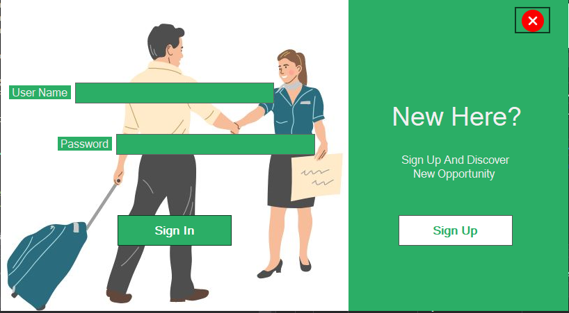

<b>
Assalamualaikum I created this desktop application using C#(100% done by me). so, let's get into the full application, </b> 

This is the main interface for login to all users (admin, host, guest). By default, admin username and password are admin. 

but if you are a guest or host first you must go through the registration process 

Ho- (host registration) and Gu- (guest registration) are used for identifying guest or host directly.  

also use from validation for all fields 

After registration, you have to wait for admin confirmation to active the id. 

this is the admin dashboard. admin can check if there are requests that have arrived or not like pending requests, checkout request  

so,there is one request that has arrived, admin can check the request and confirm it. 

this is host dashboard.  

this is guest dashboard. 

datadase table are also available in the project folder, name data table.txt 
this is a university project.I made this for some people of my university. I hope you like it. 

thank you for reading this. if you have any questions, please contact me at my email address: <b> shariarhosain131529@gmail.com  </b>  
